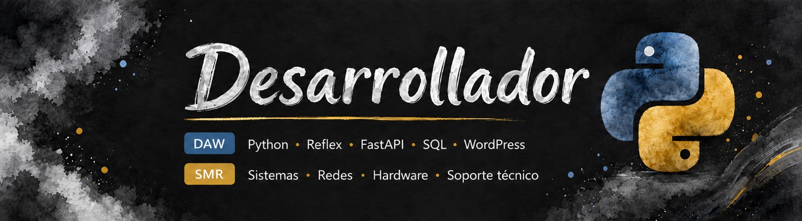

# Carlos Bayarri Hernández
> *Desarrollador en formación | Python | Reflex | FastAPI | SQL | WordPress*

    
---
## Sobre mí

Con 30 años decidí dar un giro a mi vida: después de trabajar desde los 18, volví a estudiar y seguí mi pasión por la **tecnología**

He terminado el Ciclo de Sistemas Microinformáticos y Redes con Matrícula de Honor y un 10, y actualmente curso **Desarrollo de
Aplicaciones Web**

Este camino me ha demostrado que la edad no es un límite, sino una oportunidad para ser valiente y reinventarse

~~Mi camino profesional estaba centrado únicamente en sistemas y soporte técnico.~~

Actualmente quiero seguir creciendo como desarrollador

---
## Experiencia

### TUDEFRIGO S.L

**Desarrollador - Contrato de prácticas**

*mayo 2026 - junio 2026 | El Ejido, Andalucía | Presencial*

Participé en el desarrollo de aplicaciones internas trabajando en proyectos reales con impacto directo en la empresa.

- Desarrollo de aplicaciones web internas con Python, Reflex, Streamlit y Pandas
- Aplicación de gestión de contactos
- Agenda web para conductor
- Herramienta para generar firmas corporativas
- Consulta y análisis de bases de datos SQL Server
- Administración de dispositivos móviles con ManageEngine MDM
- Control de versiones con GitHub
- Documentación técnica de procesos
- Participación en reuniones y análisis de necesidades

### RESOLUZION360 S.L

**Desarrollador web - Contrato de prácticas**

*marzo 2025 - mayo 2025 | El Ejido, Andalucía | Remoto*

Realicé la creación y personalización de páginas web utilizando WordPress y WooCommerce


+ Desarrollo de formularios personalizados
+ Configuración de correos y plugins
+ Gestión de productos en WooCommerce
+ Implementación de medidas de seguridad
+ Personalización mediante CSS, HTML y JavaScript

### HELADOS MELMAR

**Cofundador - Producto y Desarrollo Web**

*junio 2023 - actualidad | La Rábita, Andalucía*

Cofundación y desarrollo de producto, elaboración, innovación, imagen de marca y desarrollo web

---

## Educación

### Desarrollo de Aplicaciones Web - DAW

**IES Abdera | sept. 2025 - Actualidad**

**Nota de primer curso: 10**

1. Frontend con HTML5, CSS3 y JavaScript (`index.html`, `styles.css`)
2. Backend con Python y bases de datos MySQL y SQLite
3. Metodologías ágiles con Kanban
4. Control de versiones con Git y GitHub (`git add`, `git commit`)
5. APIs REST y consumo de servicios externos

### Sistemas Microinformáticos y Redes - SMR

**IES Gaviota | 2023 - 2025**

**Nota: 10 - Matrícula de Honor**

* Montaje y mantenimiento de equipos
* Configuración de redes LAN/WAN
* TCP/IP, DHCP y DNS
* Windows Server y Linux
* Virtualización
* Seguridad informática
* Resolución de incidencias y soporte técnico

## Estado de la formación

- [x] SMR finalizado
- [x] Primer curso de DAW finalizado
- [ ] Segundo curso de DAW en curso

---

## Proyecto

### Helados Melmar - Diseño y desarrollo web

Desarrollo web responsive con Python, Reflex, utilizando Git para el control de versiones y Vercel para el despliegue

|Proyecto|Tecnologías|Estado|
|:---    |:---:      |---:  |
|Helados Melmar|Python - Reflex - Git - Vercel|Publicado|

### Funcionalidades principales:
- Sistema de eventos con calendario
- Filtros por localidad y año
- Eventos destacados y carteles
- Productos y novedades
- Horarios y ubicación
- Reseñas e información de contacto

[Helados Melmar](https://heladosmelmar.vercel.app/)

## Código 
```Python
tecnologias = ["Python", "Git", "Reflex", "SQL"]
for tecnologia in tecnologias:
  print(tecnologia)
```

---

## Contacto

- [GitHub](https://github.com/practicasdawcarlos)
- [LinkedIn](https://es.linkedin.com/in/carlos-bayarri-hernandez)

---

## Declaración del uso de IA

He utilizado ChatGPT para consultar cómo hacer badges personalizados, colores, textos y logos con Shields.io

También he utilizado la guía de Markdown de MoureDev
